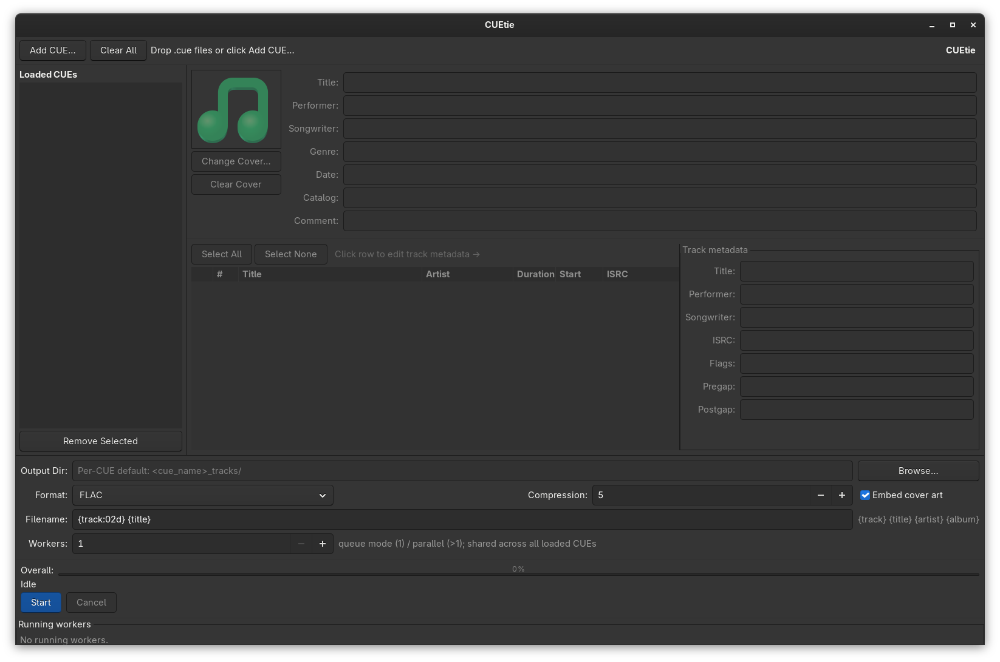

# CUEtie

GTK3 desktop application for splitting CUE sheet audio into individual tracks with full metadata and cover art support.


## Screenshot



## Features

- **Full CUE spec parsing** — `CATALOG`, `CDTEXTFILE`, `PERFORMER`, `SONGWRITER`, `TITLE`, `FILE`, `TRACK`, `FLAGS`, `ISRC`, `PREGAP`, `POSTGAP`, `INDEX`, all `REM` extensions
- **Multi-CUE support** — load many CUE sheets at once via multi-select dialog or drag-and-drop; sidebar lists every loaded CUE with live selected/total track counts
- **Queue & parallel processing** — `workers = 1` runs jobs as a FIFO queue; `workers > 1` spawns that many parallel ffmpeg subprocesses across every pending task of every CUE
- **Per-CUE output directory** — each CUE remembers its own destination (default `<cue_name>_tracks/` next to the cue)
- **Unified progress** — overall progress bar and per-task status line span the entire batch
- **Track picker** — select any subset of tracks via checkboxes before splitting
- **Per-track metadata editor** — edit title, performer, songwriter, ISRC inline; changes apply to output tags
- **Album metadata editor** — edit title, performer, genre, date, catalog, comment before processing
- **Cover art** — auto-detected from adjacent images (`folder.jpg`, `cover.png`, …) or `REM COVER`; replaceable via file picker; embedded into output files
- **Output formats** — FLAC, MP3 (libmp3lame), OGG Vorbis, Opus, WAV
- **Quality control** — FLAC compression level, bitrate for lossy formats
- **Filename templates** — `{track:02d} {title}`, `{artist} - {title}`, etc.
- **ffmpeg validation** — checks binary and required encoders on startup
- **Drag & drop** — drop one or many `.cue` files onto the window
- **Processing log** — ffmpeg output streamed to in-app log panel
- **Cancel** — abort in-progress batch at any time; terminates all running ffmpeg workers

## Requirements

| Dependency | Purpose |
|---|---|
| Python 3.10+ | Runtime |
| [ffmpeg](https://ffmpeg.org/) | Audio splitting and encoding |
| [PyGObject](https://pygobject.gnome.org/) | GTK3 UI |
| [mutagen](https://mutagen.readthedocs.io/) | Metadata and cover art embedding |

## Installation

### NixOS / nix-shell

```bash
git clone https://github.com/csoftware-arigpt/cuetie
cd cuetie
nix-shell
python -m cuetie
```

### Arch Linux

```bash
git clone https://github.com/csoftware-arigpt/cuetie
cd cuetie
sudo pacman -S python-gobject gtk3 ffmpeg python-mutagen
pip install -e .
python -m cuetie
```

### Debian / Ubuntu

```bash
git clone https://github.com/csoftware-arigpt/cuetie
cd cuetie
sudo apt install python3-gi python3-gi-cairo gir1.2-gtk-3.0 ffmpeg
pip install mutagen
pip install -e .
python -m cuetie
```

### Fedora

```bash
git clone https://github.com/csoftware-arigpt/cuetie
cd cuetie
sudo dnf install python3-gobject gtk3 ffmpeg python3-mutagen
pip install -e .
python -m cuetie
```

### Docker (web UI via noVNC)

Run CUEtie in a container and use it from your browser — no local GTK or ffmpeg required. The container ships Xvfb + fluxbox + x11vnc + websockify + noVNC behind an nginx reverse proxy.

#### Prebuilt image (GHCR)

```bash
docker run -d --name cuetie \
  -p 8080:8080 \
  -v "$(pwd)/data:/data" \
  --shm-size=256m \
  ghcr.io/csoftware-arigpt/cuetie:latest
```

Open <http://localhost:8080> — the page auto-redirects to noVNC's lightweight viewer and auto-connects to the VNC session.

Drop `.cue` files and their companion audio into the `./data` directory on the host; inside the container they appear at `/data`. Use **Add CUE…** and the file picker to navigate to `/data`.

#### Docker Compose

```bash
git clone https://github.com/csoftware-arigpt/cuetie
cd cuetie
docker compose up -d
```

`docker-compose.yml` binds `./data` → `/data`, exposes port 8080, sets `VNC_RESOLUTION=1366x768x24`, and restarts on failure.

#### Build locally

```bash
docker build -f docker/Dockerfile -t cuetie:local .
docker run -d -p 8080:8080 -v "$(pwd)/data:/data" --shm-size=256m cuetie:local
```

#### Configuration

| Variable | Default | Purpose |
|---|---|---|
| `VNC_RESOLUTION` | `1920x1080x24` | Xvfb screen geometry `WxHxDEPTH` |
| `DISPLAY` | `:99` | X display used by Xvfb and CUEtie |

Ports:
- `8080/tcp` — HTTP + WebSocket (nginx → websockify → x11vnc)

Stop the container with `docker stop cuetie` or `docker compose down`.

## Usage

```bash
# Open GUI
python -m cuetie

# Open with a CUE file directly
python -m cuetie /path/to/album.cue
```

1. Open a `.cue` file via **Open CUE…** or drag-and-drop
2. Review and edit album metadata in the top panel
3. Click a track row to edit its title, performer, ISRC in the right panel
4. Check/uncheck tracks to include in the split
5. Choose output directory and format
6. Click **Start**

## CUE Spec Coverage

| Field | Supported |
|---|---|
| `CATALOG` | ✓ |
| `CDTEXTFILE` | ✓ |
| `PERFORMER` | ✓ global + per-track |
| `SONGWRITER` | ✓ global + per-track |
| `TITLE` | ✓ global + per-track |
| `FILE … WAVE/AIFF/MP3/BINARY` | ✓ |
| `TRACK n AUDIO` | ✓ |
| `FLAGS DCP 4CH PRE SCMS` | ✓ parsed |
| `ISRC` | ✓ |
| `PREGAP` / `POSTGAP` | ✓ parsed |
| `INDEX 00/01/…` | ✓ |
| `REM GENRE/DATE/DISCID/COMMENT` | ✓ |
| `REM COVER` | ✓ |
| Any other `REM` key | ✓ stored |

## License

GNU Affero General Public License v3.0 — see [LICENSE](LICENSE).
